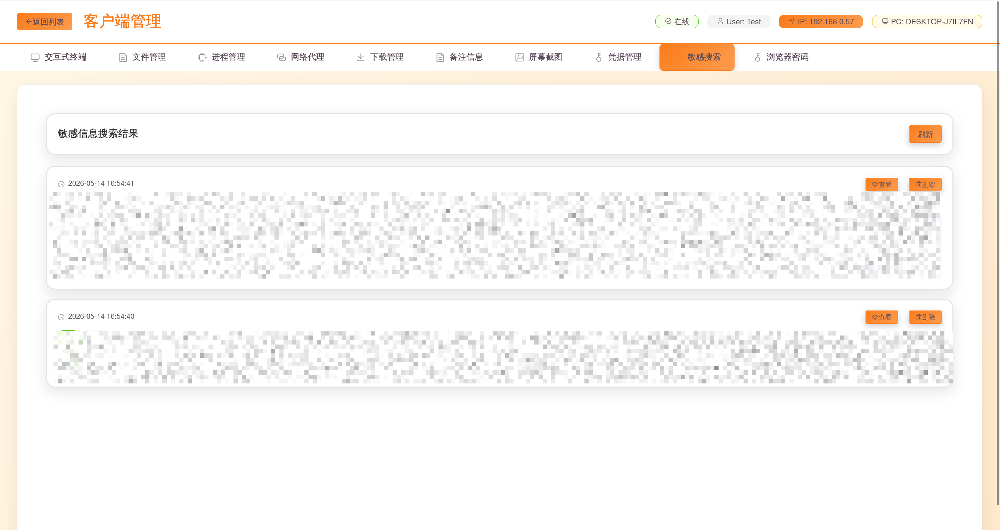
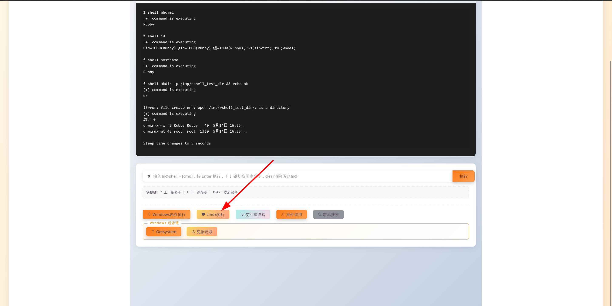
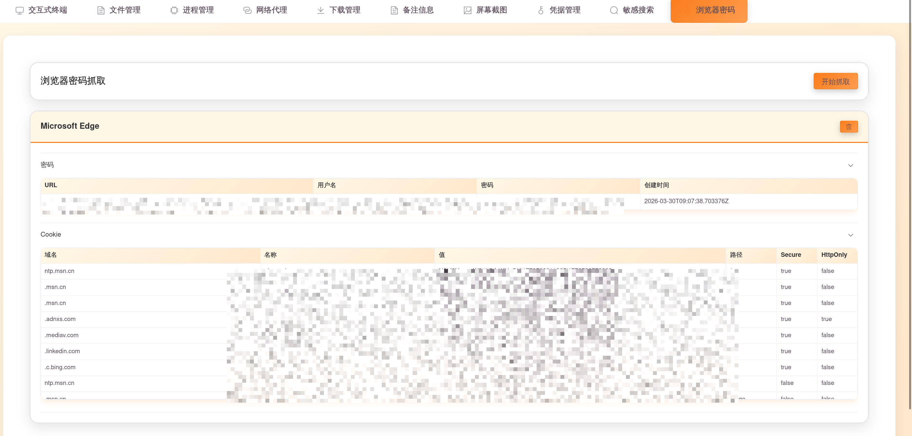
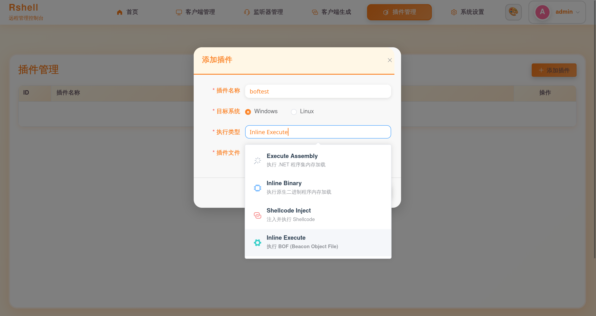
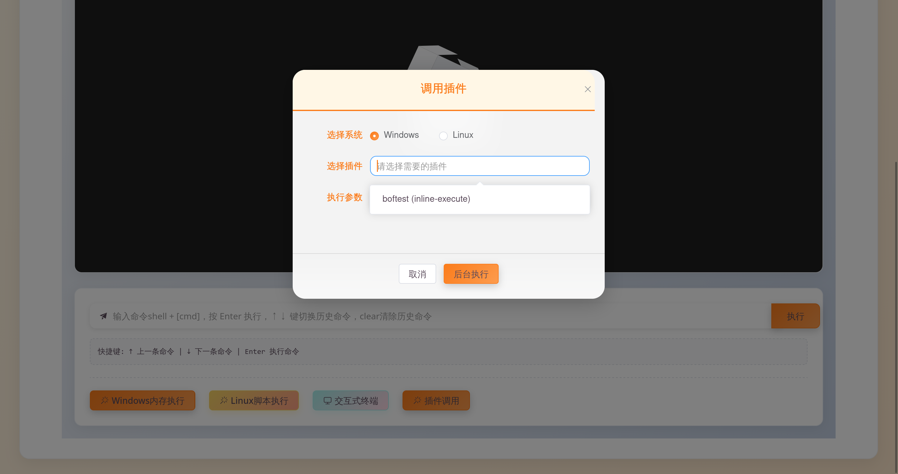

# Rshell 使用文档

## 账号密码

**账号:admin**

**密码:首次运行后随机生成**


## 主题修改

### 修改主题颜色


### 添加背景图片


## 添加listener

目前支持websocket、tcp、kcp、http、oss协议监听：


## 生成客户端

支持windows、linux、darwin

**注：客户端可选配置反沙箱密码上线  如： r.exe tNROopcR45q4Z8I1**


## Webdelivery


## 客户端管理

### 支持Note、颜色标记


### 命令执行

shell + [cmd]


### 交互式终端

建议在websocket、tcp、kcp的长连接协议下使用，http协议下可以将sleep时间设置为0，以获得低延迟体验。


### 文件管理

双击进入文件夹：


### PID查看


杀毒软件识别


### 文件下载


### 笔记


### 敏感信息搜索

递归扫描指定路径下的配置文件、脚本、源码等，匹配其中的密码、密钥、令牌、JDBC 连接字符串等敏感信息。

**内置检测规则**：

| 规则 | 匹配内容 |
|------|---------|
| 云密钥 | `accessKeyId`, `accessKeySecret` |
| 口令/密码 | `password=`, `passwd=`, `密码=` |
| 用户名 | `username=`, `user=`, `用户名=` |
| JDBC | `jdbc.driver=`, `jdbc.url=` |
| 腾讯云 IM | `sdkappid`, `privateKey`, `identifier` |

**扫描的文件类型**：`.env`, `.conf`, `.json`, `.ini`, `.xml`, `.yaml`, `.yml`, `.sql`, `.properties`, `.config`, `.txt`, `.md`

**使用方式**：

1. 在 Shell 页面点击 **"敏感搜索"** 按钮
2. 输入要扫描的路径（例如 `/home/user` 或 `C:\Users\admin`）
3. 点击"开始搜索"，结果实时流式返回并在 Shell 中显示
4. 或点击顶部导航栏的 **"敏感搜索"** 进入独立视图查看所有搜索结果




---

## Windows相关

### shellcode生成：

生成步骤：

（1）新建监听；
（2）建立对应监听的windows版的webdelivery；
（3）在对应的webdelivery的右侧，有shellcode生成的选项。

新增windows的webdelivery后，可以生成stage分阶段的shellcode（体积较小，方便上线）：


### 内存执行

windows内存执行 支持Execute Assembly(.net程序内存执行)、Inline Bin(其他exe程序内存执行)、shellcode执行(执行shellcode,方便上线其他C2等)、Inline Execute(执行BOF)：


#### execute-assembly

执行badpotato提权：


#### inline-bin

内存执行fscan：


#### shellcode-inject

上线msf：


#### inline-execute

执行bof：


### Getsystem（提权）

支持 6 种提权技术按顺序自动尝试：

| 技术  | 名称                         | 原理                                                         |
| ----- | ---------------------------- | ------------------------------------------------------------ |
| **1** | Named Pipe (In Memory/Admin) | 创建命名管道 → 创建 SYSTEM 服务连接管道 → `ImpersonateNamedPipeClient` |
| **2** | Named Pipe (Dropper/Admin)   | 同技术 1，但通过落地 DLL 执行（需 elevator DLL）             |
| **3** | Token Duplication            | 启用 `SeDebugPrivilege` → 枚举 SYSTEM 进程 → `DuplicateTokenEx` |
| **4** | RPCSS Handle Stealing        | 打开 RPCSS 进程 → `NtQueryInformationProcess` 枚举句柄表 → 窃取 SYSTEM Token |
| **5** | PrintSpooler                 | 创建命名管道 → `RpcRemoteFindFirstPrinterChangeNotification` 触发 spoolsv SYSTEM 连接 |
| **6** | EfsPotato                    | 创建命名管道 → `EfsRpcEncryptFileSrv` 触发 LSASS/EFS SYSTEM 连接 |

**使用方式**：

```
getsystem        尝试全部 6 种技术
getsystem 1      仅测试技术 1（命名管道）
getsystem 3      仅测试技术 3（Token 复制）
```

成功获取 SYSTEM 令牌后，后续 `shell` 命令以 SYSTEM 身份执行。


### Mimikatz（凭据窃取）

全自动 LSASS 凭据窃取流程，无需手动交互：

1. 目标执行 `mimikatz` 命令
2. `MiniDumpWriteDump` 通过回调方式在内存中转储 LSASS
3. AES-256-GCM 加密后分块回传服务端
4. 服务端收到后自动解密
5. 调用 `pypykatz lsa minidump` 解析凭据
6. 凭据自动存入数据库，前端实时查看

**使用方式**：

```
mimikatz   一键完成转储 → 回传 → 解密 → 解析 → 入库
```

**支持提取的凭据类型**：

| 类型      | 来源    | 用途                 |
| --------- | ------- | -------------------- |
| NTLM Hash | msv1_0  | 哈希传递攻击（PTH）  |
| 明文密码  | wdigest | 直接登录             |
| 明文密码  | credman | 凭据管理器保存的密码 |

**前提条件**：

服务端需安装 pypykatz：

```bash
pip install pypykatz
```


---


## Linux 相关

### Linux 脚本执行

上传 `.sh` 脚本文件，植入端通过 `sh -s` 从 stdin 管道执行，无文件落地

### Linux 内存执行

上传 ELF 二进制文件，植入端将其写入 `/tmp/.*` → chmod +x → 执行 → **进程运行中立即删除临时文件**（利用 Linux 已运行程序可以从磁盘删除的特性）。



**使用场景**：上传 fscan 等 Linux 工具，执行后不留磁盘痕迹。

---

## Windows 浏览器密码抓取

支持抓取以下浏览器的密码、Cookie、历史记录和信用卡信息：

| 浏览器 | 密码 | Cookie | 说明 |
|--------|------|--------|------|
| Chrome | ✓ | ✓ | 支持 V10(DPAPI) + V20(ABE) |
| Chrome Beta | ✓ | ✓ | |
| Edge | ✓ | ✓ | 支持 ABE |
| Firefox | ✓ | ✓ | NSS PBE 解密 |
| 360 安全浏览器 | ✓ | ✓ | 旧版 Chromium，DPAPI |
| 360 极速浏览器 X | ✓ | ✓ | |
| QQ 浏览器 | ✓ | ✓ | |
| 搜狗浏览器 | ✓ | ✓ | |
| Opera / Opera GX | ✓ | ✓ | |
| Brave | ✓ | ✓ | |
| Vivaldi | ✓ | ✓ | |
| Chromium | ✓ | ✓ | |

**使用方式**：

1. 在客户端 Shell 页面顶部的导航栏中点击 **"浏览器密码"** 进入独立视图
2. 点击 **"开始抓取"** 按钮
3. 等待植入端扫描所有已安装浏览器并解密数据（约 10-60 秒）
4. 结果按浏览器分组展示在折叠面板中，支持展开查看密码表、Cookie 表、历史记录

**技术原理**：

- **V10 解密**：从 `Local State` 读取 `os_crypt.encrypted_key` → Base64 解码 → 去掉 `DPAPI` 前缀 → `CryptUnprotectData` → AES-256-GCM 解密每条记录
- **V20 解密（Chrome 127+）**：读取 `os_crypt.app_bound_encrypted_key` → 通过远程线程注入到浏览器进程获取 ABE 密钥 → AES-GCM 解密
- **Firefox**：读取 `key4.db` + `logins.json` → NSS ASN1 PBE 解密



---


## 插件管理

新增插件：



调用插件：




## 上线提醒

支持多种上线提醒方式：


---

## Rshell-Skills（AI Agent 操控技能包）

Rshell-Skills 是为 AI Agent（如 OpenCode、Cursor、Claude Code）提供的 C2 操控技能包，使 AI 能够通过自然语言交互完成对 Rshell 控制端的全量操作。

**项目地址**：`https://github.com/Rubby2001/Rshell-Skills`

**技能包含的内容**：

| 章节 | 内容 | 适用场景 |
|------|------|---------|
| 认证与鉴权 | 登录流程、JWT Token 获取、Authorization2 头部传递 | 首次连接 Rshell API |
| 完整 API 路由参考 | 69 个路由的 HTTP 方法、路径、输入/输出 JSON 格式 | AI 自动调用 API |
| 通用客户端操作流程 | 命令执行、文件浏览下载、凭据抓取、后渗透 | 指导 AI 按步骤操作客户端 |
| 常见问题 | Token 过期、超时、ABE 编译标记等 | 异常排查 |

**使用方式**：

在 AI 工具的配置中引用此技能：

```yaml
available_skills:
  - name: rshell-c2
    description: Rshell C2 框架控制端操作指南
    location: https://raw.githubusercontent.com/Rubby2001/Rshell-Skills/master/SKILL.md
```

**效果**：AI 获得完整认证流程、API 路由表、客户端操作流程后，可自主完成登录 → 查看客户端 → 执行命令 → 抓取凭据等操作。
